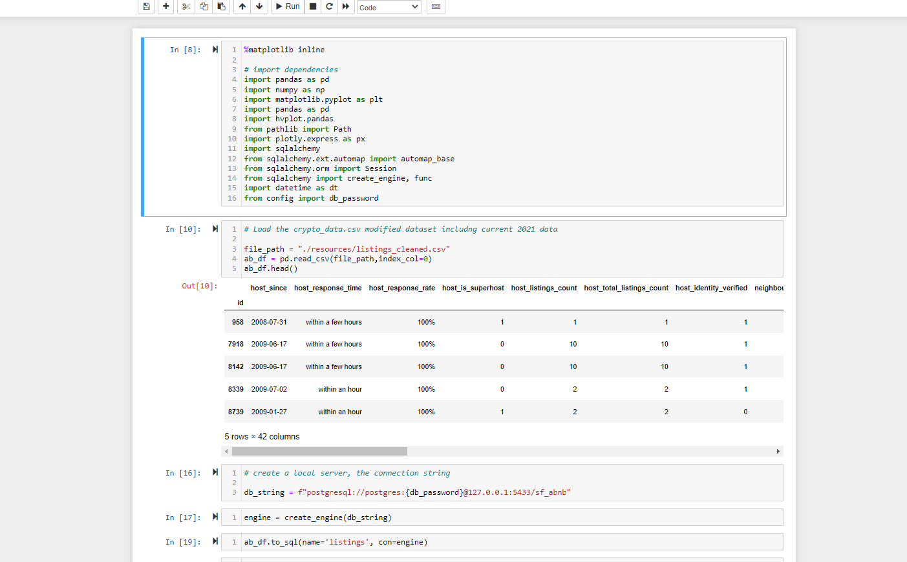
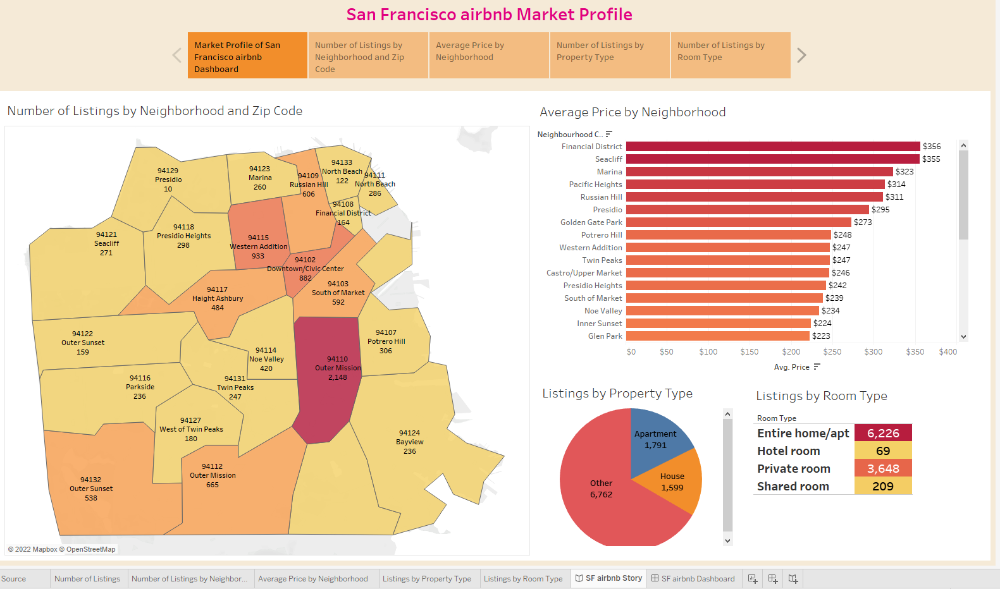

# Project : Analyzing San Francisco Airbnb listings and evaluating pricing, popularity, features and accommodations by listing
 
# Project Outline:
 
Since its inception in 2008, Airbnb has disrupted the traditional hospitality industry as more travelers decide to use Airbnb as their primary means of accommodation. Airbnb offers travelers a more unique and personalized way of accommodation and experience.
 

 
 
# Project Resources and Acknowledgements:
 
1. This dataset has one file- sf_airbnblistings.csv which has columns describing features such as host id, hostname, listing id, listing name, latitude and longitude of listing, the neighborhood, price, room type, minimum number of nights, number of reviews, last review date, reviews per month, availability, host listings and city.
 
2. This dataset is a compilation of multiple datasets found on Inside Airbnb.( http://insideairbnb.com/get-the-data.html)
 
3. stack overflow
 
# Team Communication channels:
 
1. Zoom calls
   
2. Slack
   
3. Mobile and Emails
 
 
# Team Questions Summary:
 
Does this data contain enough information?
 
Looking at different columns which data cleaning techniques can we utilize the best? Via Excel or Pandas?
 
What can we learn about the neighborhoods" e.g. like close to GG Park, close to Union Sq / financial district etc?
 
Based on different factors is it possible to recommend a title to the host for his/her listing?
 
Based on data can we do geographical analysis?
 
What storage technique will be best for data storage? postgres or MongoDB or AWS or GWS?
 
Can we use different machine learning techniques?
 
What area of database will be best for Tableau dashboard presentation?
 
# Description of the data exploration phase of the project:
 
As a team we reviewed data that is been saved as sf_airbnblistings.csv and  we came to a decision to explore this in more details in regards to deliverables that we are targeting
 
To explore this large data set in an unstructured way and to uncover initial patterns, characteristics, and points of interest we came to following conclusions
 
1. Data is more in detail in terms of features, geographical location, pricing, amenities etc..
   
2. Data needs cleaning in some areas as there are 106 columns and about 6121  listings. We will be using excel or pandas for this purpose to identify the correlation between
   variables ( Continuous and categorical)
   
3. We also decided to use graphical displays of data, such as bar charts and scatter plots, which are valuable tools in visual data exploration.
 
4. We really need to see what can we do to target current database and possible future searches and begin the process of excluding irrelevant data points and search paths that may
 
   turn up no results
 
#  Technologies, languages, tools, and algorithms used throughout the project:
 
As a team we did our brainstorming session and came to a decision on what technology or programming language we can use. Things can change according to future project
 
development.
 
We did ask following questions to ourselves:
 
1. Any specific requirement of dependencies, features, and tools for the programming language?
 
2. Which language can support the project ecosystem that can have a major impact on the project timeline and we can work around some constraints.
 
3. Are we comfortable in working with this languages and plan for deliverables
 
   
We came to following conclusion after this questions to support our project:
 
 
1. Technology Resources: Excel, Python, SQL,   Tableau
 
2. Operating Systems: Windows or Mac.
 
3. Front End Development: JavaScript, HTML, and CSS
 
4. Data Storage: Postgresql, MongoDB, AWS or GCS
 
5. Backend Development: Python
 
6. Data analytics / Machine Learning: Python or R
 
7. Data modeling Technique: Supervised learning using linear regression or other methods
 
# Result of analysis:
 
Currently our team is align on technology to use for current deliverables and can be updated as we go along with project requirement on adding any new deliverables
 
# Deliverables:
 
1. Predictions:
   
   
   a) San Francisco hosts joining Airbnb each month
   
 
   b) San Francisco hosts joining Airbnb and listings getting their first review in each month
 
   b) San Francisco Airbnb listings getting their first review each month
 
   c) Number of listings per host and Change per year
 
   d) Nightly price change/year
 
   e) Advertised Price range and Distribution
 
2. Describe a region using the names of listings in that region
 
   a) Plotting the number of listings in each SF neighbor
 
   b)  Finding Median price of Airbnb listings in SF neighborhood
 
   
3. Estimate the popularity of a listing based on given features
   
   a) accommodation by how many, bathrooms, bedrooms and beds
 
4. Features based accommodation: The number of guests, number of bedrooms, bathrooms, beds, price, minimum_nights, maximum_nights, number_of_reviews
 
 
# Recommendation for future analysis
 
1. ETL process using geojson file as well that is added to our resource folder
 
2. Predicting accuracy of results using different data modeling techniques
   
3. Adding more current data to file if available in regards to see how a pandemic can affect businesses
 
# Anything the team would have done differently:
 
A question that has always been a center of attention but at this point we are sure that we want to move forward with the dataset and focus more on how to make this project
 
successful using available technology that we learned so far.
 
# Images for our initial approach to project:
 
1. Importing dependencies and Reading csv
 

 
2. Initial cleaning of some data columns types which are least concern to deliverables
   

 
3. ERD Diagram
   

 

 
4. Database table creation
 

 
5. Database Tables in pgAdmin using join function
 

 
6. Provisional DB to pgAdmin
   

 
7. pgAdmin data reading
 

 
8. 
 
9. Label Encoder
 

 
10. DB to ML
   

 
# Machine Learning Model:
 
1. Description of preliminary data preprocessing:
   
   a) Stage:
   
   
 
   b) Process used:
 
   
 
 
2. Description of preliminary feature engineering and preliminary feature selection, including their decision making process
 
a) Preliminary feature engineering:
 
The process of creating new features from raw data to increase the predictive power of the learning algorithm was not easily apparent. To capture additional engineered features in
 
in the original feature set we selected a key subset of features to reduce the dimensionality of the training problem by eliminating irrelevant, redundant, or highly correlated features.
 
Training data consists of a matrix composed of rows and columns. Although many of the raw data fields can be used directly to train a model, it was important for us to create additional (engineered) features for an enhanced training dataset to provide information that better differentiates the patterns in the data.
 
b) Preliminary feature selection:
 
With the goal of constructing effective features in the training data, two regression models are built using the same algorithm but with two different training datasets. The two datasets represent the same raw input data, but with an increasing number of features set. These features are grouped into two categories:
 
1) All columns to see overall accuracy score against price
   
      

 
1) Only columns that can contribute to predictics better pricing model
   

 
3. Decision Making process:
   
a) Selecting Data: Integrate data, de-normalize it into a dataset, collect it together.
 
b) Preprocess Data: Format it, clean it, sample it to make it work.
 
c) Transform Data: Feature Engineer can be possible or not
 
d) Model Data: Create models, evaluate them and tune them.
 
3.  Description of how data was split into training and testing sets:
 
We used the scikit-learn Python machine learning library to provides an implementation of the train-test split evaluation procedure via the train_test_split() function.
 

 
The train-test split procedure is appropriate here due to large dataset
 
Also Sklearn provided the functionality to split the dataset for training and testing. Splitting the dataset is essential for an unbiased evaluation of prediction performance.
 
 
4. Explanation of model choice, including limitations and benefits:
 
Model used: Logistic Regression
 
Logistic regression can help find the probability of event success and event failure. In our dataset the dependent variable are binary(0/1) in nature. It supports categorizing data into discrete classes by studying the relationship from a given set of labeled data. This model learns a linear relationship from the given dataset and then introduces a non-linearity in the form of the Sigmoid function.
 

 
 
# A blueprint for the dashboard
 

# link to Google slide:

https://docs.google.com/presentation/d/1YdTfHFZa4LuGV4T-gGrehBDw-RvZP2CwBLBRZTNz02M/edit#slide=id.p

# link to Dashboard:

https://public.tableau.com/app/profile/david.nathanael/viz/SFAirBNBProject/SFAirBNBDashboard?publish=yes

